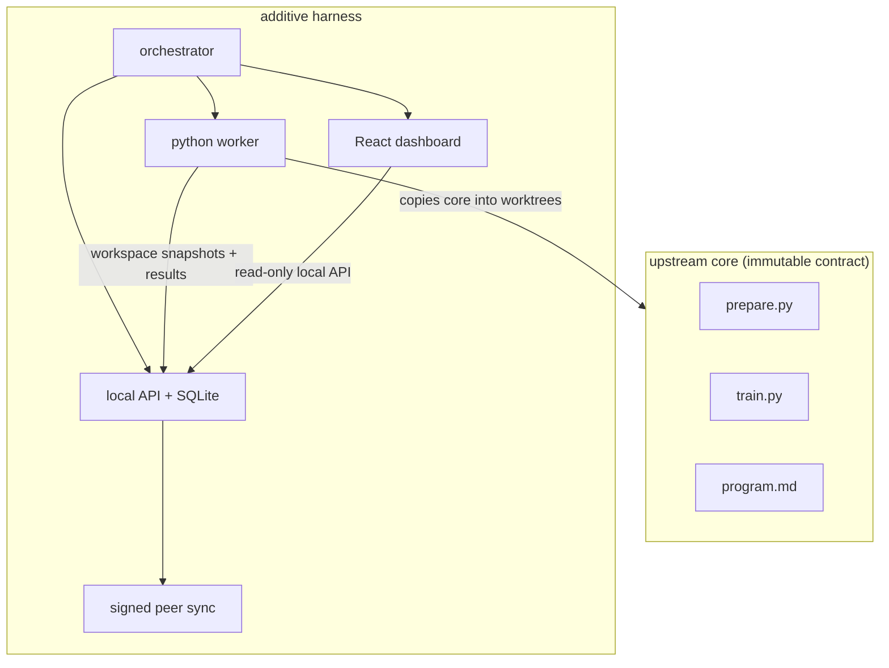
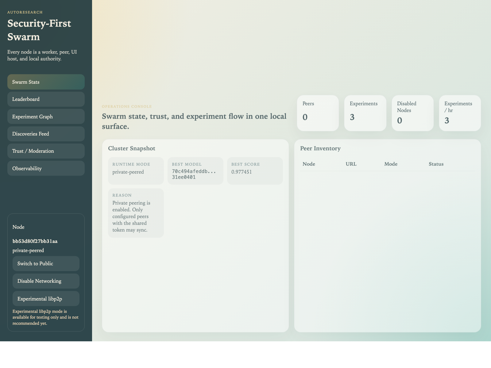
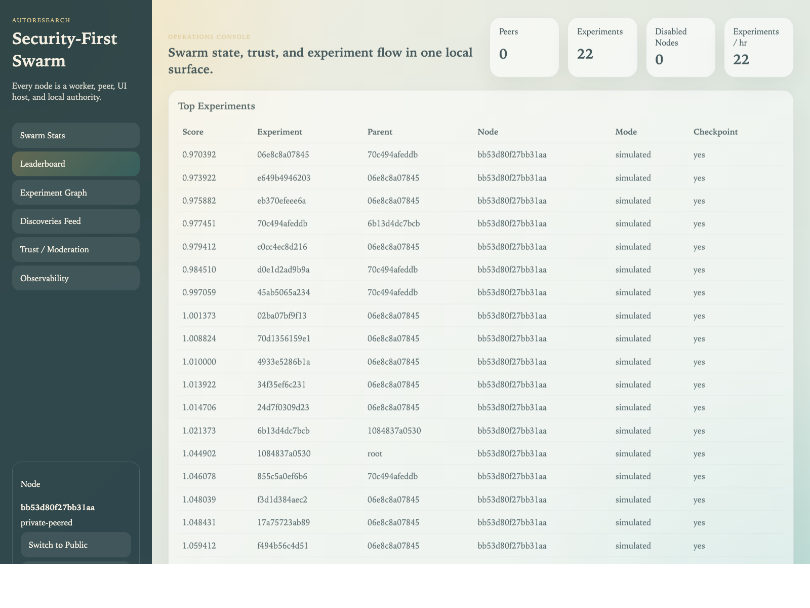
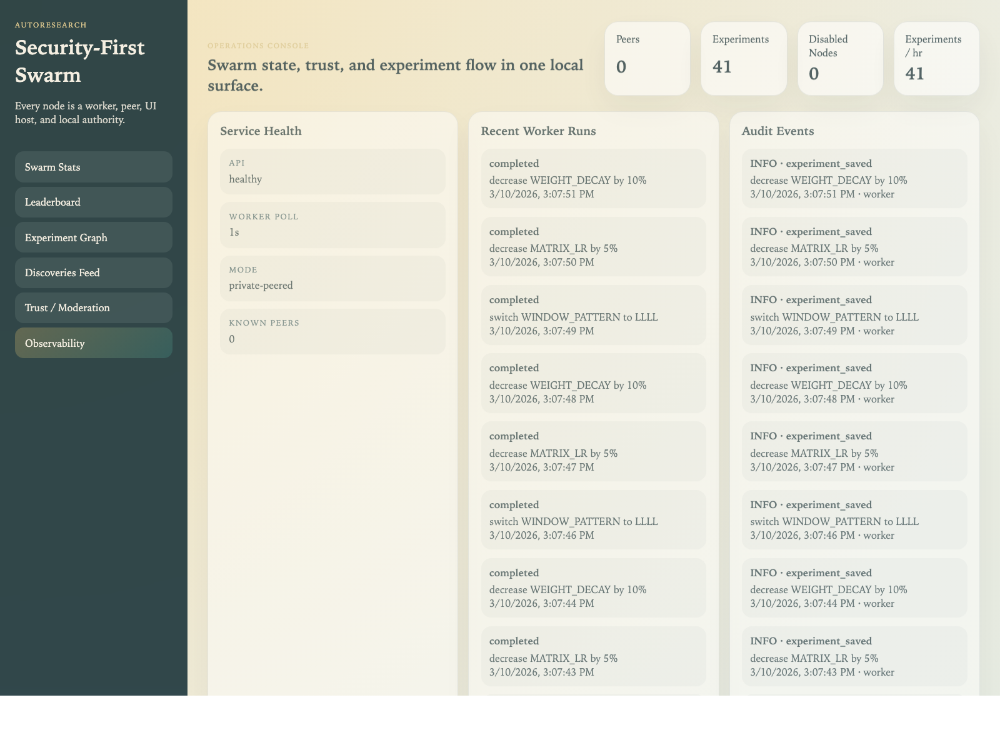

# Autoresearch Swarm Harness

Autoresearch Swarm Harness is a security-first wrapper around the upstream `autoresearch` core. It keeps the original trainer entrypoints at the repo root, then layers local orchestration, a protected peer-sync surface, a local SQLite-backed API, a React dashboard, and an isolated worker loop around them.

## Mission

The goal is to turn each node into the same full-stack participant:

- local experiment worker
- optional swarm peer
- local dashboard host
- local trust authority

Every node should be able to run autonomously, observe the swarm, and stay safe even when peers are malicious.

## The Problem This Project Addresses

The upstream project is intentionally small and powerful, but it is optimized for a single local agent editing and running `train.py`. That leaves several engineering gaps if you want a secure swarm:

- no peer trust boundary
- no local moderation surface
- no durable experiment/state service
- no observability dashboard
- no harness layer for safe upstream syncing

This project addresses those gaps without rewriting the upstream trainer into a new architecture.

## Technical Approach

The harness is additive:

- the upstream core remains at the repo root and is treated as the immutable contract
- a platform-core overlay selects the default CUDA trainer or the Apple Silicon trainer automatically
- a Python worker snapshots that core into disposable workspaces for each experiment
- the worker mutation step is pluggable: heuristic fallback, direct Codex CLI, or Ernest-Agent
- a local TypeScript API owns persistence, trust policy, and signed peer metadata handling
- a React dashboard presents stats, graph state, moderation, and observability
- private peering is the default runtime posture and is the only mode that supports real swarm inheritance
- public peering is opt-in and remains metadata-only
- libp2p exists only as an experimental transport mode and is not recommended yet

Remote data is never treated as executable authority in public mode. In private mode, authenticated peers can share full experiment lineage, so that mode should only be used with operators you trust.

## How It Works

Each local node follows this flow:

1. The orchestrator starts the API, worker, and dashboard.
2. The worker asks the API for the best eligible parent for its execution mode.
3. In `private-peered` mode that parent may be remote if it includes authenticated `train.py` lineage plus a checkpoint manifest.
4. The worker snapshots the immutable core into a disposable workspace, selects the platform core (`default` or `macos`), applies the inherited `train.py` source, and mutates it locally.
5. The worker restores a parent checkpoint when one is available, then runs a real experiment when the environment is ready, otherwise a clearly labeled simulated run.
6. Each completed run produces a local checkpoint artifact and structured metadata.
7. The worker posts results back to the API, which hashes, signs, stores, and projects the experiment into leaderboard, graph, discovery, trust, and observability views.
8. If peering is enabled, the API exchanges signed experiment envelopes with configured peers. Public mode strips executable lineage; private mode preserves it.

## Architecture At A Glance



## Why This Is Built As A Harness

This repo is designed to keep pulling updates from the original autoresearch project. That only works if the integration boundary stays narrow.

Key harness rules:

- keep the upstream core files at the root
- keep platform-specific trainer variants in additive overlays under `platform_cores/`
- avoid refactoring the upstream training code into the harness packages
- interact with the core via workspace snapshots, subprocesses, and file contracts
- isolate all swarm/API/UI/security logic in additive directories

That makes upstream syncs a maintenance workflow, not a rewrite project. See [docs/upstream-sync.md](docs/upstream-sync.md).

## Platform Core And Agent Backends

The worker has two local selection layers:

- `HARNESS_PLATFORM_CORE=auto|default|macos`
- `HARNESS_AGENT_BACKEND=auto|heuristic|codex|ernest-agent`

Platform core:

- `auto` chooses `macos` on Apple Silicon and `default` everywhere else
- `platform_cores/macos/` is derived from the `miolini/autoresearch-macos` fork and keeps the Apple Silicon / MPS trainer separate from the root upstream core

Agent backend:

- `auto` prefers Ernest-Agent when configured, then Codex CLI when available, then the built-in heuristic mutator
- `codex` uses the local Codex CLI directly against the disposable workspace
- `ernest-agent` sends the mutation task to a local Ernest-Agent server and keeps the workspace boundary scoped to `worktrees/`
- `heuristic` keeps the original deterministic mutation loop as a dependency-free fallback

These are local-only mutation backends. Peer data never decides which prompt, command, or agent backend runs.

When Ernest-Agent is the selected backend, the orchestrator will:

- build the Ernest server bundle
- build the Ernest observability UI bundle
- start Ernest locally
- expose an embedded Ernest-Agent page inside the harness dashboard

## Security Philosophy

Security is the first design constraint, not a bolt-on:

- first start defaults to `private-peered`
- public peering is explicit opt-in
- private peering is the recommended mode for now
- public peering is signed metadata only
- private peering can share authenticated `train.py` lineage plus checkpoint manifests
- public-mode remote experiments are `observe-only`
- private-mode authenticated experiments can participate in scheduling when they include a checkpoint
- public-mode remote code, prompts, patches, models, and shell instructions are forbidden
- private-mode code and checkpoint inheritance is a trust-scoped feature for known peers, not an open-public path
- local moderation is authoritative; remote reputation is advisory only
- `libp2p-experimental` exists for testing only and is not recommended for normal use

The system assumes adversarial peers. Signatures prove identity, not honesty.

See [docs/security.md](docs/security.md) and [docs/threat-model.md](docs/threat-model.md).

## Dashboard And Observability

The local dashboard runs on `http://127.0.0.1:4173` when the harness starts. Views include:

- Swarm Stats
- Leaderboard
- Experiment Graph
- Discoveries Feed
- Trust / Moderation
- Observability
- Ernest Agent

The Observability page is modeled after the Ernest-Agent style of local operations visibility: worker run history, live audit events, service health, and security-relevant activity all in one surface.
When Ernest-Agent is enabled, the dashboard also embeds the Ernest observability UI directly from the local Ernest server.

## Dashboard Screenshots

The README screenshots below are generated from a live local node in `simulated` mode:

```bash
npm run docs:screenshots
```

That script starts the orchestrator, waits for experiment data to appear, captures the dashboard with headless Chrome, and writes the images into `docs/screenshots/`.

### Swarm Stats



### Leaderboard



### Observability



## Testing

The repo ships with unit, integration, security, and e2e suites:

```bash
npm test
npm run test:full
npm run test:unit
npm run test:integration
npm run test:security
npm run test:e2e
npm run test:coverage:ui
npm run build
npm run check:core
npm run check:docs
```

Python worker unit tests are included in the default test run. The UI control surface also has a hard 90% line-coverage gate for `apps/ui/src/api.ts` and `apps/ui/src/dashboard-view.tsx`. See [docs/testing.md](docs/testing.md).

## Quick Start

```bash
# 1. install node dependencies for the harness
npm install

# 2. optional: review or override local defaults
#    committed defaults live in .env.local.default
#    machine-specific overrides belong in .env.local

# 3. start the full local stack
npm run start
```

This launches:

- local API on `http://127.0.0.1:4172`
- local React dashboard on `http://127.0.0.1:4173`
- local worker loop
- private peer sync by default when peers are configured
- checkpoint inheritance and remote parent selection only in private swarm mode
- public peering only if explicitly enabled

For a private swarm, set a shared token before starting:

```bash
export SWARM_PRIVATE_NETWORK_TOKEN="replace-me"
npm run start
```

To force the Apple Silicon core or a specific mutation backend:

```bash
export HARNESS_PLATFORM_CORE=macos
export HARNESS_AGENT_BACKEND=codex
npm run start
```

To run node mutations through Ernest-Agent instead of the built-in worker mutator:

```bash
# put these in .env.local for a persistent local override
export HARNESS_AGENT_BACKEND=ernest-agent
export HARNESS_ERNEST_AGENT_ROOT="../Ernest Agent"
npm run start
```

With that configuration the orchestrator auto-starts the local Ernest-Agent server, scopes it to `worktrees/`, and the Observability page reports the selected agent backend and platform core.

## Local Env Defaults

Config precedence is:

1. shell environment
2. `.env.local`
3. `.env.local.default`

Implementation detail:

- the loader reads `.env.local.default` first, then `.env.local`
- keys already present in the shell are never overwritten

Practical meaning:

- `.env.local.default` is committed and carries repo-level defaults
- `.env.local` is gitignored and is for machine-specific overrides
- shell exports still win when you need one-off runs

The committed repo default backend is `auto`. This workspace opts into Ernest-Agent locally through [.env.local](/Users/cory/Documents/autoresearchSwarm/.env.local), which is gitignored and machine-specific by design.

Experimental libp2p mode is available only when explicitly unlocked:

```bash
export HARNESS_ALLOW_LIBP2P_EXPERIMENTAL=1
```

Even with that flag set, it should be treated as unsupported and not recommended.

For full setup, upstream core usage, and development workflows, see [QUICKSTART.md](QUICKSTART.md).

## Docs Index

- [QUICKSTART.md](QUICKSTART.md) - install, run, private-default mode, peering options, and common commands
- [docs/architecture.md](docs/architecture.md) - module boundaries, workspace model, control flow, and invariants
- [docs/security.md](docs/security.md) - trust boundaries, admission control, moderation, and operational guidance
- [docs/testing.md](docs/testing.md) - suite layout, commands, and CI expectations
- [docs/api.md](docs/api.md) - local API endpoints and internal contracts
- [docs/threat-model.md](docs/threat-model.md) - assets, adversaries, abuse cases, and mitigations
- [docs/upstream-sync.md](docs/upstream-sync.md) - harness philosophy and upstream merge workflow

## Project Status

Current implementation status:

- additive harness packages around the upstream core
- local API with SQLite persistence and signed metadata envelopes
- Python worker with disposable workspace snapshots and checkpoint promotion
- private-swarm checkpoint inheritance and remote parent selection
- explicit peering enable/disable controls
- local trust and moderation surface
- React dashboard with observability page
- unit, integration, security, and e2e coverage

Not yet included:

- recommended libp2p transport
- public-mode executable lineage
- blockchain/PoW admission costs
- automatic network-wide enforcement

## Contributing

Contributions are expected to preserve the harness model:

- keep upstream compatibility in mind
- add tests with new functionality
- update docs when interfaces or workflows change
- do not route remote data into execution paths

Start with the architecture and security docs before large changes.
